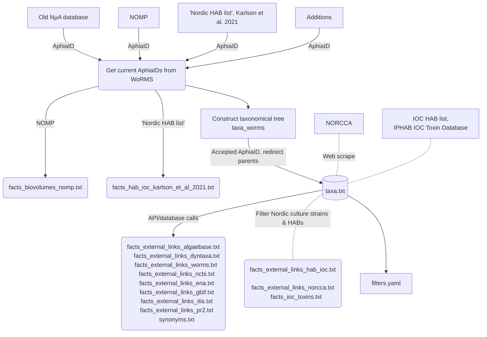

# Nordic Microalgae: Data pipeline

This repository contains R and Python scripts designed to gather the necessary data for updating the taxonomic backbone of Nordic Microalgae. The process involves interacting with various APIs, databases and webpages from key sources including [WoRMS](https://www.marinespecies.org/), [Dyntaxa](https://namnochslaktskap.artfakta.se/), [AlgaeBase](https://www.algaebase.org/), [GBIF](https://www.gbif.org/), [NORCCA](https://norcca.scrol.net/), [IOC-UNESCO Toxins database](https://toxins.hais.ioc-unesco.org/), [PR2](https://pr2-database.org/) and [SHARK](https://shark.smhi.se/). The taxonomic data pipeline is initiated through the execution of the R Markdown document `update-nua-taxonomy.Rmd`. The data is input manually into the [content](https://github.com/nordicmicroalgae/content), which is then integrated into the [backend](https://github.com/nordicmicroalgae/backend).

## Prerequisites
- Python interpreter installed for use in R with the `reticulate` package. Refer to [rstudio.github.io/reticulate](https://rstudio.github.io/reticulate/) for details.
- Install the R package `SHARK4R` (> 0.1.6) for API queries towards Dyntaxa and AlgaeBase. See installation details on [github.com/sharksmhi/SHARK4R/](https://github.com/sharksmhi/SHARK4R/).
- Make sure you have the latest version of the `pr2database` package installed in R. See installation details on [PR2 R package](https://pr2database.github.io/pr2database/articles/pr2database.html)
- Obtain API keys for Dyntaxa and AlgaeBase. To acquire a key for Dyntaxa, subscribe to the 'Taxonomy' product via the [SLU Artdatabanken developer portal](https://api-portal.artdatabanken.se/). Request keys from AlgaeBase directly from their developer team.  Store your API keys in `.Renviron`. Use the provided function to edit this file easily:

```r
install.packages("usethis")
usethis::edit_r_environ("project")
```
Edit your .Renviron to look like this (fake checksums provided below):
```
ALGAEBASE_APIKEY = "e1482dc9abfe073d56db08c0b604e333"
DYNTAXA_APIKEY = "89ad0b9cac6ce53184cc942147e1f06f"
```
## Update Process
Follow these steps to update the species content:
1. Clone this repository.
2. Store your API keys in `.Renviron` as instructed above.
3. Download the latest NOMP biovolume list (in .xlsx format) from the [Nordic Microalgae webpage](https://nordicmicroalgae.org/biovolume-lists/) and save it in `/data_in/`.
4. Download the latest complete IOC HAB list in .txt format from the [IOC-UNESCO Taxonomic Reference List of HAB](https://www.marinespecies.org/hab/aphia.php?p=download&what=taxlist) and store it in `/data_in/`.
5. Download the latest IPHAB database export from [IOC-UNESCO Toxins database](https://toxins.hais.ioc-unesco.org/) and store as .txt in `/data_in/`.
6. Make sure you have the latest version of the `pr2database` installed, see details above.
7. If needed, manually add additional taxa existing in WoRMS to the database in `/data_in/additions_to_old_nua.txt`.
8. Run the `update-nua-taxonomy.Rmd` script. Note that API calls may take 10-11 hours to run if lists are not loaded from cache.
9. Check the output for potential duplicated taxa names, errors or missing taxa listed in the .html report in `/update_history/`. Taxa can be excluded using `/data_in/blacklist.txt`, while unaccepted taxa can be enforced to remain using `/data_in/whitelist.txt`. Return to Step 5 to include additional taxa (set cache = TRUE and run the script again).
10. Push updated lists from `/data_out/content` to [nordicmicroalgae/content/species](https://github.com/nordicmicroalgae/content/tree/master/species) and verify GitHub CI checks.
11. Run the syncdb app as a superuser from the admin pages to import the new species content into the backend. Check logs for potential problems.
12. Check for any images assigned as taxon = 'none' after the import and assign them to their current names.
13. Verify updated Quick-View filters in `/data_out/backend/taxa/config` and push to [nordicmicroalgae/backend](https://github.com/nordicmicroalgae/backend) if needed.
14. Corrections to the Quick-View filters can be made in `/data_in/plankton_groups.txt`, defining major groups for Kingdom and Phylum. 'Other microalgae' are defined as everything else except groups specified under `exclude_from_others`.
15. Upload new .xlsx and .txt versions of the checklist from `/data_out/` to data.smhi.se.

## Workflow

The data pipeline builds upon the existing taxonomy in WoRMS, translating only unaccepted and deleted taxa. It is rooted in the database of the previous version of Nordic Microalgae, supplemented by taxa from the NOMP biovolume file, HAB taxa sourced from Karlson et al. 2021, and additional manually curated taxa. Higher taxonomic classifications are aggregated from all parent taxa, redirecting them to their closest accepted relatives. Links and factual data are gathered via diverse API and database calls and integrated into the database (`taxa.txt`) using their corresponding taxon_id (current AphiaID). Information from the NORCCA culture collection is acquired through HTML scraping, with links to all strains originating from Northern Europe cataloged and stored. The extensive IOC HAB and NORCCA lists are filtered down to the species present in the database. In addition, the taxonomic content is compared to the phytoplankton taxa present in the "Svenskt HavsARKivs" (SHARK) database.


## References

- Karlson, B., Andersen, P., Arneborg, L., Cembella, A., Eikrem, W., John, U., West, J.J., Klemm, K., Kobos, J., Lehtinen, S., Lundholm, N., Mazur-Marzec, H., Naustvoll, L., Poelman, M., Provoost, P., De Rijcke, M., Suikkanen, S., 2021. Harmful algal blooms and their effects in coastal seas of Northern Europe. Harmful Algae. Feb;102:101989. doi: [10.1016/j.hal.2021.101989](https://doi.org/10.1016/j.hal.2021.101989). Epub 2021 Mar 6. PMID: 33875185.
